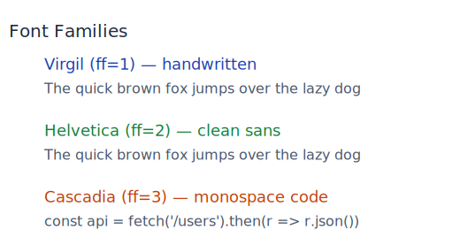
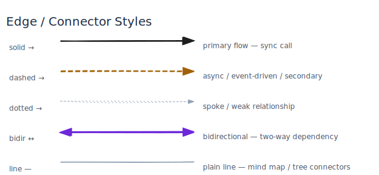

# excalidraw-agent-cli

> Tell Claude what to draw. It picks the diagram type, plans the layout, writes the script, renders it, reads the PNG, and iterates until it passes a 7-point visual checklist. You get a hand-drawn Excalidraw diagram in seconds — `.excalidraw` + `.svg` + `.png`.

```bash
pip install excalidraw-agent-cli
excalidraw-agent-cli install-skill   # one-time — teach Claude to diagram
```

Then in any Claude Code session:

```
"Draw a system architecture for a three-tier web app"
"Create a flowchart for the user signup and email verification process"
"Diagram the CI/CD pipeline as a feedback loop"
"Visualize the JWT authentication flow between browser, gateway, auth service, and DB"
"Show the microservices architecture with an event bus and async fan-out"
"Mind map the React & TypeScript ecosystem"
```

---

## What it does

The CLI lets AI agents build `.excalidraw` files element-by-element — no browser needed, pure JSON mutations, real Excalidraw rendering. There are two generation modes, and the bundled skill knows which to use:


**Approach A — Dagre** (default): Write `graph.json` with nodes, edges, and optional zones. No coordinates needed — `dagre-layout.js` auto-computes all positions. Use for everything: architecture, flowcharts, mind maps, ER, state, CI/CD, data pipelines.

**Approach B — CLI** (sequence diagrams only): Write a bash script calling `element add` and `element connect` with explicit `x,y` coordinates. Use only for sequence diagrams — lifelines require precise horizontal alignment that layout algorithms can't guarantee.

Both produce identical output: the same `.excalidraw` JSON, the same Puppeteer rendering, the same hand-drawn aesthetic.

---

## The skill pipeline

Install the skill once. After that, just describe what you want — Claude runs this pipeline automatically:


The self-inspection loop is what makes this more than one-shot generation. Claude reads the exported PNG with its vision, checks 7 quality items (labels readable, arrows directed correctly, no text overflow, colors consistent with the recipe, title clearance), and iterates up to 3 times if anything fails.

---

## Install

```bash
pip install excalidraw-agent-cli
```

**Requires Node.js ≥ 18** for SVG/PNG export (`brew install node` or [nodejs.org](https://nodejs.org)).
Node dependencies are auto-installed on first export into `~/.cache/excalidraw-agent-cli/` — nothing else needed.

---

## Install the Claude Code skill

```bash
# Global — available in every Claude Code session on this machine
excalidraw-agent-cli install-skill

# Into a specific project — committed to git, shared with the team
excalidraw-agent-cli install-skill --codebase .

# Overwrite an existing installation
excalidraw-agent-cli install-skill --force
```

After installation, just describe what you want in natural language. Claude picks the diagram type, chooses dagre or CLI based on the complexity, loads the matching layout recipe, generates the script, exports, inspects, and iterates.

| Install mode | Path | When to use |
|---|---|---|
| Global (default) | `~/.claude/skills/excalidraw/` | Your personal machine — available everywhere |
| Codebase | `./.claude/skills/excalidraw/` | Team projects — checked into git |

---

## What the skill contains

The skill is a set of reference files Claude loads on demand. It never loads everything at once — just `SKILL.md` plus the files relevant to the current diagram type.


```
~/.claude/skills/excalidraw/
├── SKILL.md                   ← workflow, quality checklist, philosophy
└── references/
    ├── color-palette.md       ← semantic hex pairs (bg + stroke) per concept type
    ├── cli-reference.md       ← full CLI syntax, bash helper patterns
    ├── patterns.md            ← visual pattern library (fan-out, swim lanes, cycles...)
    ├── layout-rules.md        ← 26 layout rules, label-width formula, coordinate templates
    ├── diagram-type-rubric.md ← decision table: which diagram type for which request
    ├── dagre-reference.md     ← graph.json schema, when to use dagre, zone patterns
    └── diagram-recipes/
        ├── flowchart.md       ← coordinate grid, color defaults, pitfalls
        ├── sequence.md
        ├── mindmap.md
        ├── architecture.md
        ├── er-diagram.md
        ├── class-diagram.md
        ├── state-diagram.md
        └── gantt.md
```

Each recipe gives Claude a layout template, semantic color defaults, and a pitfall list for that diagram type. The 26 layout rules enforce constraints like minimum label width, zone clearance, and arrow label placement — so diagrams don't break as complexity grows.

---

## Example prompts and outputs

These were all generated by Claude using this skill — the prompt is shown alongside each result.

### Dagre approach — complex graphs

**Prompt**: *"Create a mind map of modern software engineering. Five main branches: Frontend, Backend, Data, DevOps, Architecture. Each branch should expand into subcategories and then specific tools and technologies."*


50+ nodes, 3 levels, asymmetric branch depths — Dagre handles all positions.

---

**Prompt**: *"Diagram the React & TypeScript ecosystem as a mind map. Six branches: State Management (with Redux → Toolkit/Saga/Thunk as sub-levels), Routing, Testing, Build Tools, Type System, UI Libraries. No arrowheads — this is associative, not directed."*


44 nodes, intentionally different branch depths. The asymmetry is structural — not manually positioned.

---

**Prompt**: *"Draw a Kubernetes cluster architecture. Four zones: External Traffic, Control Plane, Worker Nodes, Storage. Show the full component graph: Ingress → kube-apiserver, kubelet, etcd, scheduler, controller-manager, kube-proxy, pods, PersistentVolume."*


---

**Prompt**: *"Show the full cloud-native SaaS platform stack: CDN/WAF edge, API Gateway, 6 domain services (User, Product, Order, Inventory, Notification, Billing), platform layer (Kafka, Redis, Vault, LaunchDarkly), data tier (PostgreSQL, Elasticsearch, InfluxDB), and observability (Prometheus, Jaeger, Loki). Use solid arrows for sync calls, dashed for async."*


7 zones, 32 nodes, 44 edges. Zone bounding boxes are computed automatically.

---

**Prompt**: *"Draw a user signup flowchart. Start with 'User signs up' → validate email (Email valid? diamond) → yes: Hash password → Save to Postgres → Send verify email → Account created. No branch: Return 422."*


---

**Prompt**: *"Draw a three-tier architecture with swim lane zones: CLIENTS (Web App, Mobile App, Partner API), SERVICES (API Gateway, Auth Service, Core API, Notification Svc), DATA (PostgreSQL, Redis Cache, SQS Queue). Use color coding: blue for clients, green for services, purple for data."*


---

**Prompt**: *"Show a microservices architecture with 4 zones: CLIENT LAYER (Web App, Mobile App), GATEWAY (API Gateway), SERVICES (Auth Service, Order Service), BACKENDS / ASYNC (Redis Cache, EventBus SNS, Notification Svc). Labeled arrows, dashed for async connections."*


---

### Not just programming — any domain

**Prompt**: *"Draw an org chart for a startup: CEO → CTO / VP Product / VP Design. CTO manages Backend EM, Frontend EM, DevOps Lead. Each EM has a Senior Engineer and two Engineers."*


---

**Prompt**: *"Draw a customer journey map for e-commerce with five phases: Awareness, Consideration, Purchase, Post-Purchase, Retention. Solid arrows within each phase, dashed arrows between phases."*


---

**Prompt**: *"Draw a 'What to cook tonight?' decision flowchart with time and preference questions leading to 8 meal outcomes. Add a dashed try-again arrow from 'Order takeout' back to the start."*


---

**Prompt**: *"Visualize a Claude Code session debugging a memory leak — no template. OOM alert → 3 parallel reads → 3 competing hypotheses (diamonds) → investigate each in parallel, two dead ends (gray, ❌ ruled out), one winner (green, ✅ found in pool.js:47) → fix → load test → verified. Gray out the dead-end paths, make the winning path bolder."*

This one has no template. The prompt describes the story, and the graph structure carries the meaning: diamond = hypothesis, ellipse = observation, blue = gathering information, yellow = uncertain, green = resolved, gray = ruled out.


---

### CLI approach — sequence diagrams only

**Prompt**: *"Draw a JWT authentication sequence diagram with 4 participants: Browser, API Gateway, Auth Service, PostgreSQL. Show the full login flow: POST /auth/login, verify credentials, SELECT user, return JWT, then a protected request with Authorization header, token validation, and the successful response."*


---

## Visual style guide

All styling options rendered as output images. Applies to both dagre and CLI approaches.

### Fill styles


`none` (default) = transparent background, border only. `solid` = flat color fill, automatically used when a fill color is specified. `hachure` and `cross-hatch` are opt-in for the hand-drawn texture look. Zone backgrounds always use `solid`.

### Roughness levels


`0` = clean vector. `1` (default) = hand-drawn wobble. `2` = very sketchy. Use `--roughness 0` or `--clean` for presentation-ready output.

### Font families



`virgil` (default) = Excalidraw's handwritten font. `normal` = Helvetica. `mono` = Cascadia Code. In dagre: `--font virgil|normal|mono`. Per-element in CLI: `--ff 1|2|3`.

### Shapes


`rectangle` (default), `ellipse` (mind map nodes, root), `diamond` (decisions in flowcharts).

### Arrow styles



`solid` for primary flow, `dashed` for async/secondary, `dotted` for weak/hub-to-spoke connectors, plain line (`--end-arrowhead none`) for mind map spokes. Bidirectional: `--start-arrowhead arrow --end-arrowhead arrow`.

### Semantic color palette


Colors are semantic — the same `bg`/`stroke` pair everywhere for the same concept type. The dark Root node requires `fillStyle: solid` (set automatically by dagre when `textColor` is white).

---

## Dagre layout — complex graphs without coordinates

```bash
# 1. Write graph.json — nodes, edges, zones; no x/y
cat > arch.json << 'EOF'
{
  "direction": "TB",
  "title": "My Architecture",
  "zones": [
    { "id": "web", "label": "WEB TIER", "fill": "#dbeafe", "stroke": "#93c5fd",
      "labelColor": "#1e40af", "nodeIds": ["nginx", "cdn"] }
  ],
  "nodes": [
    { "id": "nginx", "label": "Nginx",    "fill": "#bfdbfe", "stroke": "#1e40af" },
    { "id": "api",   "label": "API",      "fill": "#86efac", "stroke": "#15803d" },
    { "id": "db",    "label": "Postgres", "fill": "#ddd6fe", "stroke": "#6d28d9" }
  ],
  "edges": [
    { "from": "nginx", "to": "api", "stroke": "#15803d" },
    { "from": "api",   "to": "db",  "stroke": "#6d28d9", "style": "dashed" }
  ]
}
EOF

# 2. Compute layout → full .excalidraw with all positions
DAGRE=$(python3 -c "import excalidraw_agent_cli,os; print(os.path.join(os.path.dirname(excalidraw_agent_cli.__file__),'..','dagre-layout.js'))")
node "$DAGRE" arch.json --output arch.excalidraw

# 3. Export
excalidraw-agent-cli --project arch.excalidraw export png --output arch.png --overwrite
excalidraw-agent-cli --project arch.excalidraw export svg --output arch.svg --overwrite
```

### graph.json schema

**Top-level**

| Key | Values | Description |
|-----|--------|-------------|
| `direction` | `LR`, `TB`, `RL`, `BT` | Layout direction (`LR` for mind maps, `TB` for architectures) |
| `rankSep` | integer (default 80) | Gap between rank levels |
| `nodeSep` | integer (default 40) | Gap between nodes in same rank |
| `title` | string | Title above the diagram |
| `arrowhead` | `"none"` | Set globally for mind maps (no arrowheads on any edge) |

**Node fields** — `id`, `label`, `width`, `height`, `fill`, `stroke`, `textColor`, `fillStyle`, `shape` (`rectangle`/`diamond`/`ellipse`), `rounded`, `fontSize`

**Edge fields** — `from`, `to`, `label`, `stroke`, `style` (`solid`/`dashed`/`dotted`), `width`

**Zone fields** — `id`, `label`, `labelColor`, `fill`, `stroke`, `nodeIds` (bounding box auto-sized)

### dagre-layout.js flags

```
node "$DAGRE" graph.json --output out.excalidraw

  --roughness 0|1|2     0=clean, 1=hand-drawn (default), 2=very rough
  --font virgil|normal|mono
  --fill hachure|solid  global default fill style (per-node fillStyle overrides this)
  --arrow-width N       arrow stroke width (default 1.5)
  --node-width N        node border width (default 2)
  --clean               shortcut: roughness=0, font=mono, fill=solid
```

**Dark node auto-rule**: if a node has `textColor: "#ffffff"`, `dagre-layout.js` automatically applies `fillStyle: solid` and `roughness: 0` — you don't need to set these manually.

---

## CLI scripting

```bash
export PATH="/path/to/.venv/bin:/path/to/node/bin:$PATH"
CLI="excalidraw-agent-cli"
OUTDIR="${DIAGRAM_DIR:-$(pwd)}"   # override via DIAGRAM_DIR env var, default = cwd
P="$OUTDIR/my-diagram.excalidraw"

# Helpers
add() {
  $CLI --project "$P" --json element add "$@" \
    | python3 -c "import sys,json;print(json.load(sys.stdin)['id'])"
}
conn() {
  local from="$1" to="$2" label="$3" color="$4" style="$5"
  local args=("--from" "$from" "--to" "$to" "--start-arrowhead" "none" "--end-arrowhead" "arrow")
  [[ -n "$label" ]] && args+=("-l" "$label")
  [[ -n "$color" ]] && args+=("--stroke" "$color")
  [[ -n "$style" ]] && args+=("--stroke-style" "$style")
  $CLI --project "$P" element connect "${args[@]}" > /dev/null
}

rm -f "$P"
$CLI project new --name "my-diagram" --output "$P" > /dev/null

# Add nodes
A=$(add rectangle --x 200 --y 200 -w 180 -h 80 \
  --label "API Gateway" --bg "#86efac" --stroke "#15803d")
B=$(add rectangle --x 480 --y 200 -w 160 -h 80 \
  --label "Auth Service" --bg "#fed7aa" --stroke "#c2410c")

# Connect
conn "$A" "$B" "authenticates" "#c2410c" "solid"

# Export
$CLI --project "$P" export png --output "$OUTDIR/my-diagram.png" --overwrite
$CLI --project "$P" export svg --output "$OUTDIR/my-diagram.svg" --overwrite
```

---

## All commands

```
project        new / open / save / info / validate
element        add rectangle / ellipse / diamond / text / arrow / line / frame
element        list / get / update / delete / move / connect
export         svg / png / json
session        status / undo / redo / history
backend        check
install-skill  [--global] [--codebase DIR] [--force]
```

Global flags (go **before** the subcommand):

```
--project  -p   Path to .excalidraw file
--json          Output as JSON (required for agent/scripting use)
```

---

## Element reference

### Shapes: `rectangle` / `ellipse` / `diamond`

| Flag | Description | Default |
|------|-------------|---------|
| `--x`, `--y` | Canvas position (top-left corner) | required |
| `-w`, `-h` | Width and height in px | `180 × 80` |
| `--label` / `-l` | Text inside the shape | none |
| `--bg` | Fill color (hex) | `#ffffff` |
| `--stroke` | Border color (hex) | `#1e1e1e` |
| `--fill-style` | `hachure`, `solid`, `cross-hatch`, `dots`, `zigzag` | `hachure` |
| `--sw` | Stroke width in px | `1` |
| `--roughness` | `0` clean · `1` default · `2` sketchy | `1` |
| `--opacity` | 0–100 | `100` |
| `--roundness` | Flag — rounds corners (rectangles only) | off |

### Text (free-floating)

| Flag | Description |
|------|-------------|
| `-t` / positional | Text content |
| `--fs` | Font size (min 12) |
| `--ff` | Font family: `1` Virgil · `2` Helvetica · `3` Cascadia Code |
| `--color` | Text color (hex) |

### `element connect`

| Flag | Values | Default |
|------|--------|---------|
| `--from` | source element ID | required |
| `--to` | target element ID | required |
| `-l` / `--label` | Arrow label | none |
| `--stroke` | hex color | `#1e1e1e` |
| `--sw` | stroke width | `2` |
| `--stroke-style` | `solid`, `dashed`, `dotted` | `solid` |
| `--start-arrowhead` | `arrow`, `bar`, `dot`, `triangle`, `circle`, or omit for none | none |
| `--end-arrowhead` | `arrow`, `bar`, `dot`, `triangle`, `circle`, `none` | `arrow` |

---

## Semantic color palette

| Concept | `--bg` | `--stroke` |
|---------|--------|------------|
| Clients / Users | `#bfdbfe` | `#1e40af` |
| Gateway / Routing | `#bbf7d0` | `#15803d` |
| Services / API | `#86efac` | `#15803d` |
| Async / Queue | `#fef08a` | `#92400e` |
| Data / Storage | `#ddd6fe` | `#6d28d9` |
| Security / Auth | `#fed7aa` | `#c2410c` |
| Observability | `#fecdd3` | `#be123c` |
| Decision diamond | `#fef3c7` | `#b45309` |
| Start / Trigger | `#dbeafe` | `#1e40af` |
| End / Success | `#a7f3d0` | `#047857` |
| Error / Reject | `#fecaca` | `#b91c1c` |
| Root / Dark emphasis | `#1e293b` | `#e2e8f0` |

Arrow color conventions:

| Relationship | `--stroke` |
|---|---|
| Primary call / request | `#1e1e1e` |
| Async / event | `#92400e` |
| Error / failure | `#dc2626` |
| Data read/write | `#6d28d9` |
| Auth / security | `#c2410c` |
| Hub-to-spoke connector | `#94a3b8` |

---

## How rendering works

```
excalidraw-agent-cli (Python)
     │  element add / connect / update
     │  → builds .excalidraw JSON in memory
     ▼
.excalidraw file
     │
     ├── export png/svg → Node.js (Puppeteer) → raster/vector output
     └── export json    → raw .excalidraw file (editable in excalidraw.com)
```

The Python layer handles all element state — no Excalidraw installation required. Node.js is invoked only for raster/vector export and auto-installs its dependencies (~52 MB) on first use into `~/.cache/excalidraw-agent-cli/`.

---

## How `--json` mode works for agents

Every `element add` returns a JSON object including the element's `id`:

```bash
$ excalidraw-agent-cli --project "$P" --json element add rectangle \
    --x 200 --y 200 -w 180 -h 80 --label "API Gateway"

{
  "status": "added",
  "id": "a3f2c1d0-...",
  "type": "rectangle",
  "x": 200, "y": 200,
  "width": 180, "height": 80,
  "label": "API Gateway"
}
```

The `id` is passed to `element connect --from` / `--to`, enabling reliable wiring without coordinate heuristics. This is what makes it agent-friendly.

---

## More examples

See [`examples/GALLERY.md`](./examples/GALLERY.md) for all examples with full prompts, approach notes, and previews.

---

## License

MIT — see [LICENSE](LICENSE)
