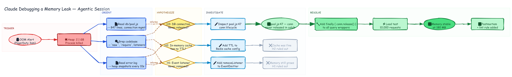

# Freeform — Claude Debugging a Memory Leak



## What this demonstrates

This diagram has **no template**. There is no "debug session" template in the skill — the graph structure itself *is* the design. This shows the tool working as a general-purpose visualizer for any complex reasoning process: agentic workflows, investigation traces, decision trees, or any non-linear thinking that doesn't fit a named diagram type.

The prompt was free-form, describing the *story* to visualize rather than the diagram type:

## Prompt

```
Visualize a Claude Code session debugging a memory leak. The session starts with
an OOM alert, fans out into 3 parallel reads (error log, codebase grep, pool.js),
forms 3 competing hypotheses (event listener leak, cache without TTL, DB connection
never released), investigates each in parallel — two dead ends and one winner —
then resolves with a fix, load test, and postmortem.

Use diamonds for hypothesis nodes, ellipses for observations/outcomes, and
gray out the ruled-out paths. Fan-out for parallel investigation, converge
to a single resolution path.
```

## Why freeform works

The dagre layout engine is domain-agnostic — it only needs `nodes`, `edges`, and optional `zones`. The meaning comes from:

- **Shape**: diamond = decision/hypothesis, ellipse = observation/outcome, rectangle = action
- **Color**: blue = information gathering, yellow = uncertain hypothesis, green = confirmed/resolved, gray = ruled out
- **Edge style**: solid = causal flow, dashed = "informs" / inference
- **Edge weight**: `width: 3` on the winning path makes it visually dominant

Any story with actors, actions, decisions, and outcomes can be expressed this way — no template required.

## Generation

```bash
DAGRE=$(python3 -c "import excalidraw_agent_cli,os; print(os.path.join(os.path.dirname(excalidraw_agent_cli.__file__),'..','dagre-layout.js'))")
OUTDIR="${DIAGRAM_DIR:-$(pwd)}"
node "$DAGRE" graph.json --output "$OUTDIR/agent-debug-session.excalidraw"
excalidraw-agent-cli --project "$OUTDIR/agent-debug-session.excalidraw" export png --output "$OUTDIR/agent-debug-session.png" --overwrite
excalidraw-agent-cli --project "$OUTDIR/agent-debug-session.excalidraw" export svg --output "$OUTDIR/agent-debug-session.svg" --overwrite
```
