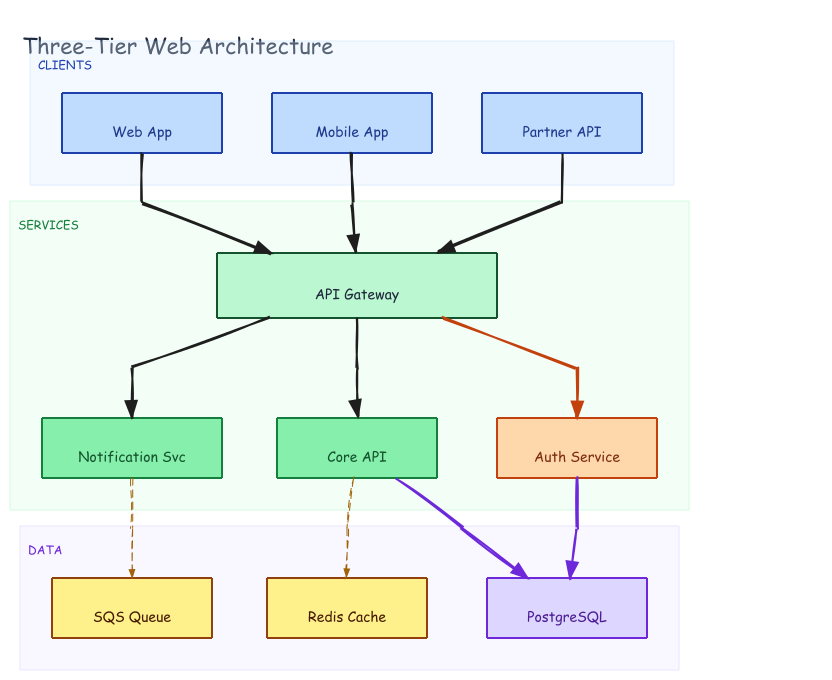

# Architecture Diagram — Three-Tier Web App



## Prompt

```
Draw a three-tier web architecture diagram with swim lanes: CLIENTS (Web App,
Mobile App, Partner API all pointing to API Gateway), SERVICES (API Gateway
wide bar, Auth Service, Core API, Notification Svc below), DATA (PostgreSQL,
Redis Cache, SQS Queue at bottom). Use color-coded zones.
```

## Generation

Generated with dagre-layout.js from [`graph.json`](./graph.json). No manual coordinates — zones and node positions are auto-computed.

```bash
DAGRE=$(python3 -c "import excalidraw_agent_cli,os; print(os.path.join(os.path.dirname(excalidraw_agent_cli.__file__),'..','dagre-layout.js'))")
node "$DAGRE" graph.json --output arch.excalidraw
excalidraw-agent-cli --project arch.excalidraw export png --output arch.png --overwrite
excalidraw-agent-cli --project arch.excalidraw export svg --output arch.svg --overwrite
```
