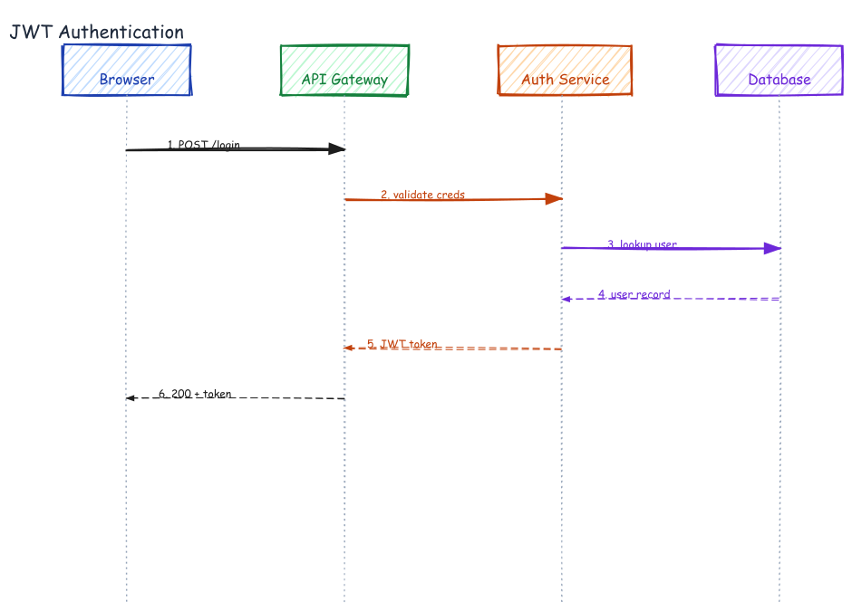

# Sequence Diagram — JWT Authentication Flow



## Prompt

```
Draw a JWT authentication sequence diagram with 4 participants: Browser,
API Gateway, Auth Service, PostgreSQL. Show the full login flow: POST /auth/login
(with JSON payload annotation below the arrow), verify credentials, SELECT user
WHERE email=?, user row (dashed return arrow), sign JWT RS256 (dashed return),
200 OK + Set-Cookie (dashed return). Number each step 1–6.
```

## Generation time

~90 seconds

## CLI commands

```bash
#!/usr/bin/env bash
set -e
export PATH="/path/to/.venv/bin:/path/to/node/bin:$PATH"
CLI="excalidraw-agent-cli"
P="/tmp/auth-sequence.excalidraw"

add() { $CLI --project "$P" --json element add "$@" | python3 -c "import sys,json;print(json.load(sys.stdin)['id'])"; }

rm -f "$P"
$CLI --json project new --name "JWT Auth Flow" --output "$P" > /dev/null

add text --x 220 --y 20 --fs 20 --ff 1 --color "#111827" -t "JWT Authentication Flow" > /dev/null

# Participant headers (4 columns: x=80, 330, 580, 830)
P1=$(add rectangle --x 30  --y 55 -w 160 -h 60 --label "Browser"      --bg "#bfdbfe" --stroke "#1e40af" --fill-style solid --roughness 0 --sw 2 --roundness)
P2=$(add rectangle --x 280 --y 55 -w 160 -h 60 --label "API Gateway"  --bg "#bbf7d0" --stroke "#15803d" --fill-style solid --roughness 0 --sw 2 --roundness)
P3=$(add rectangle --x 530 --y 55 -w 160 -h 60 --label "Auth Service" --bg "#bbf7d0" --stroke "#15803d" --fill-style solid --roughness 0 --sw 2 --roundness)
P4=$(add rectangle --x 780 --y 55 -w 160 -h 60 --label "PostgreSQL"   --bg "#ddd6fe" --stroke "#6d28d9" --fill-style solid --roughness 0 --sw 2 --roundness)

# Lifelines (vertical dashed lines under each participant)
for X in 110 360 610 860; do
  add line --x $X --y 115 --points "0,0 0,580" \
    --stroke "#94a3b8" --sw 1 --stroke-style dashed --roughness 0 > /dev/null
done

# Step 1: Browser → API Gateway (request)
add arrow --x 110 --y 195 --ex 360 --ey 195 \
  --stroke "#c2410c" --sw 2 --roughness 0 --end-arrowhead arrow > /dev/null
add text --x 113 --y 178 --fs 13 --ff 2 --color "#c2410c" -t "1. POST /auth/login" > /dev/null
add text --x 113 --y 209 --fs 11 --ff 3 --color "#64748b" -t '{"email":"…", "password":"…"}' > /dev/null

# Step 2: API GW → Auth Service
add arrow --x 360 --y 285 --ex 610 --ey 285 \
  --stroke "#1e1e1e" --sw 2 --roughness 0 --end-arrowhead arrow > /dev/null
add text --x 363 --y 268 --fs 13 --ff 2 --color "#1e1e1e" -t "2. verify credentials" > /dev/null

# Step 3: Auth Service → PostgreSQL
add arrow --x 610 --y 370 --ex 860 --ey 370 \
  --stroke "#6d28d9" --sw 2 --roughness 0 --end-arrowhead arrow > /dev/null
add text --x 613 --y 353 --fs 13 --ff 2 --color "#6d28d9" -t "3. SELECT user WHERE email=?" > /dev/null

# Step 4: PostgreSQL → Auth (return, dashed)
add arrow --x 610 --y 455 --ex 860 --ey 455 \
  --stroke "#6d28d9" --sw 2 --stroke-style dashed --roughness 0 \
  --start-arrowhead arrow --end-arrowhead none > /dev/null
add text --x 640 --y 438 --fs 13 --ff 2 --color "#6d28d9" -t "4. user row" > /dev/null

# Step 5: Auth → API GW (JWT signed, dashed return)
add arrow --x 360 --y 535 --ex 610 --ey 535 \
  --stroke "#15803d" --sw 2 --stroke-style dashed --roughness 0 \
  --start-arrowhead arrow --end-arrowhead none > /dev/null
add text --x 363 --y 518 --fs 13 --ff 2 --color "#15803d" -t "5. sign JWT (RS256)" > /dev/null

# Step 6: API GW → Browser (200 OK, dashed return)
add arrow --x 110 --y 618 --ex 360 --ey 618 \
  --stroke "#15803d" --sw 2 --stroke-style dashed --roughness 0 \
  --start-arrowhead arrow --end-arrowhead none > /dev/null
add text --x 113 --y 601 --fs 13 --ff 2 --color "#15803d" -t "6. 200 OK + Set-Cookie: token=eyJ…" > /dev/null

$CLI --project "$P" export png --output ./auth-sequence/auth-sequence.png --overwrite
```
