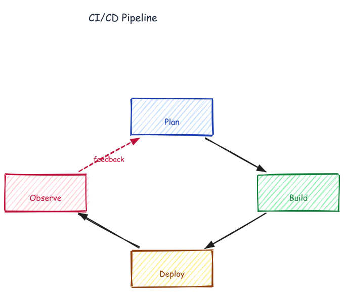

# CI/CD Pipeline — Feedback Cycle



## Prompt

```
Draw a CI/CD pipeline as a feedback cycle with 4 stages arranged in a diamond:
Plan (top), Build (right), Deploy (bottom), Observe (left). Connect them clockwise.
Add a dashed red feedback arrow from Observe back to Plan labeled "feedback".
Color each stage distinctly: Plan blue, Build green, Deploy amber, Observe pink.
```

## Generation time

~55 seconds

## CLI commands

```bash
#!/usr/bin/env bash
set -e
export PATH="/path/to/.venv/bin:/path/to/node/bin:$PATH"
CLI="excalidraw-agent-cli"
P="/tmp/cicd.excalidraw"

add() { $CLI --project "$P" --json element add "$@" | python3 -c "import sys,json;print(json.load(sys.stdin)['id'])"; }
conn() {
  local args=("--from" "$1" "--to" "$2")
  [[ -n "$3" ]] && args+=("-l" "$3")
  [[ -n "$4" ]] && args+=("--stroke" "$4")
  [[ -n "$5" ]] && args+=("--stroke-style" "$5")
  $CLI --project "$P" --json element connect "${args[@]}" --end-arrowhead arrow > /dev/null
}

rm -f "$P"
$CLI --json project new --name "CI/CD Pipeline" --output "$P" > /dev/null

add text --x 285 --y 18 --fs 22 --ff 1 --color "#111827" -t "CI/CD Pipeline" > /dev/null

# 4 stages arranged in diamond layout
PLAN=$(    add rectangle --x 350 --y 200 -w 160 -h 72 --label "Plan"    --bg "#bfdbfe" --stroke "#1e40af" --fill-style solid --roughness 0 --sw 2 --roundness)
BUILD=$(   add rectangle --x 600 --y 350 -w 160 -h 72 --label "Build"   --bg "#86efac" --stroke "#15803d" --fill-style solid --roughness 0 --sw 2 --roundness)
DEPLOY=$(  add rectangle --x 350 --y 500 -w 160 -h 72 --label "Deploy"  --bg "#fef08a" --stroke "#a16207" --fill-style solid --roughness 0 --sw 2 --roundness)
OBSERVE=$( add rectangle --x 100 --y 350 -w 160 -h 72 --label "Observe" --bg "#fecdd3" --stroke "#be123c" --fill-style solid --roughness 0 --sw 2 --roundness)

# Clockwise cycle
conn "$PLAN"    "$BUILD"
conn "$BUILD"   "$DEPLOY"
conn "$DEPLOY"  "$OBSERVE"
conn "$OBSERVE" "$PLAN"    "feedback" "#be123c" "dashed"

$CLI --project "$P" export png --output ./cicd/cicd.png --overwrite
```
