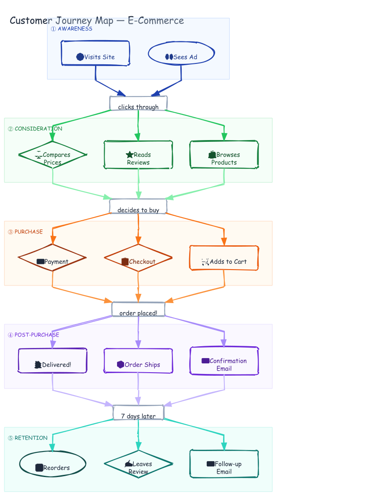

# Customer Journey Map — E-Commerce

A customer journey map for an online shopping experience, showing 5 phases from initial awareness through retention and repeat purchase.

## Diagram



## Phases

| Phase | Color | Steps |
|-------|-------|-------|
| **AWARENESS** | Blue | Sees Ad → Visits Site |
| **CONSIDERATION** | Green | Browses Products → Reads Reviews → Compares Prices |
| **PURCHASE** | Orange | Adds to Cart → Checkout → Payment |
| **POST-PURCHASE** | Purple | Receives Confirmation Email → Order Ships → Delivery |
| **RETENTION** | Teal | Follow-up Email → Leaves Review → Reorders |

Solid arrows show flow within a phase; dashed arrows show cross-phase transitions.

## Prompt Used

> Create a customer journey map for an e-commerce app with 5 phases: Awareness (Sees Ad, Visits Site), Consideration (Browses Products, Reads Reviews, Compares Prices), Purchase (Adds to Cart, Checkout, Payment), Post-Purchase (Receives Confirmation Email, Order Ships, Delivery), and Retention (Follow-up Email, Leaves Review, Reorders). Use TB direction with color-coded swim lane zones.

## Generation Command

```bash
export PATH="/Users/bhushan/Documents/excalidraw/agent-harness/.venv/bin:/Users/bhushan/.nvm/versions/node/v22.9.0/bin:$PATH"
DAGRE=$(python3 -c "import excalidraw_agent_cli,os; print(os.path.join(os.path.dirname(excalidraw_agent_cli.__file__),'..','dagre-layout.js'))")
node "$DAGRE" examples/customer-journey/graph.json --output examples/customer-journey/customer-journey.excalidraw
excalidraw-agent-cli --project examples/customer-journey/customer-journey.excalidraw export png --output examples/customer-journey/customer-journey.png --overwrite
excalidraw-agent-cli --project examples/customer-journey/customer-journey.excalidraw export svg --output examples/customer-journey/customer-journey.svg --overwrite
```

## Files

- `graph.json` — Dagre layout source (nodes, edges, zones)
- `customer-journey.excalidraw` — Editable Excalidraw source
- `customer-journey.png` — PNG export
- `customer-journey.svg` — SVG export
