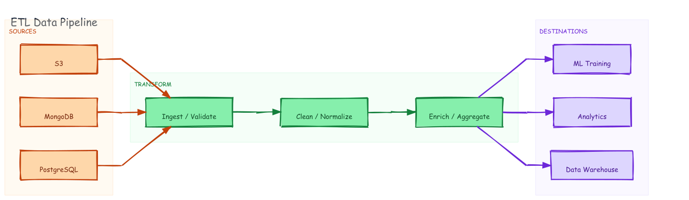

# ETL Data Pipeline — Zone Swim Lanes



## Prompt

```
Draw an ETL data pipeline with three vertical zone columns: SOURCES (MySQL DB,
Kafka Stream, S3 Raw Files), TRANSFORM (Ingest/Validate → Enrich/Join →
Aggregate), DESTINATIONS (Snowflake DWH, Elasticsearch, S3 Parquet). Color each
source distinctly. Show arrows from each source to Ingest/Validate, a vertical
chain through the transform stages, and arrows from each transform to its
matching destination.
```

## Generation

Generated with dagre-layout.js from [`graph.json`](./graph.json). Three-zone TB layout with fan-in from sources and fan-out to destinations.

```bash
DAGRE=$(python3 -c "import excalidraw_agent_cli,os; print(os.path.join(os.path.dirname(excalidraw_agent_cli.__file__),'..','dagre-layout.js'))")
node "$DAGRE" graph.json --output data-pipeline.excalidraw
excalidraw-agent-cli --project data-pipeline.excalidraw export png --output data-pipeline.png --overwrite
excalidraw-agent-cli --project data-pipeline.excalidraw export svg --output data-pipeline.svg --overwrite
```
