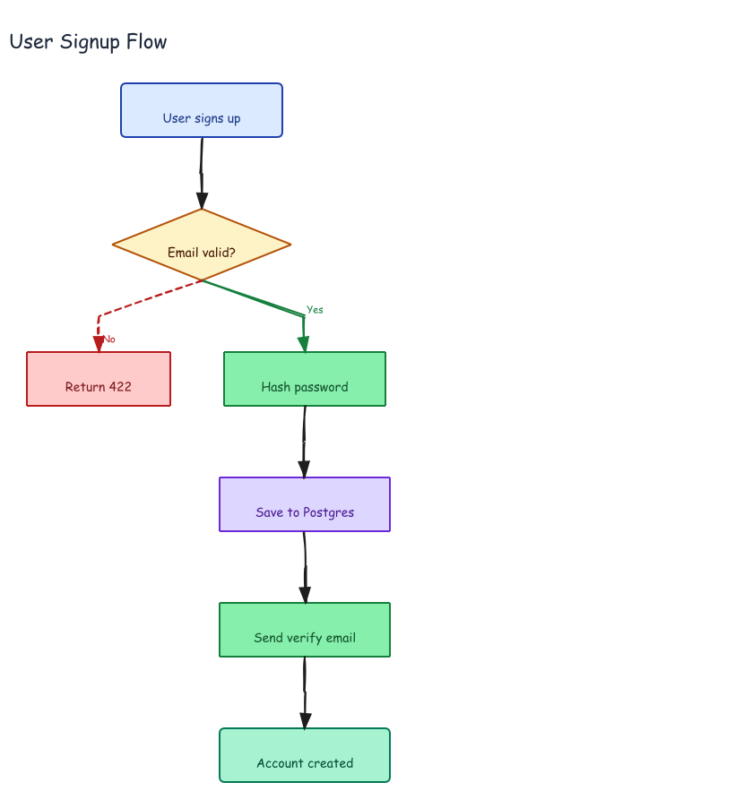

# Flowchart — User Signup



## Prompt

```
Draw a user signup flowchart. Start with "User signs up" → validate email
(Email valid? diamond) → yes: Hash password → Save to Postgres → Send verify
email → Account created. No branch: Return 422.
```

## Generation

Generated with dagre-layout.js from [`graph.json`](./graph.json). The decision diamond and branching paths are described declaratively — dagre computes the layout automatically.

```bash
DAGRE=$(python3 -c "import excalidraw_agent_cli,os; print(os.path.join(os.path.dirname(excalidraw_agent_cli.__file__),'..','dagre-layout.js'))")
node "$DAGRE" graph.json --output flowchart.excalidraw
excalidraw-agent-cli --project flowchart.excalidraw export png --output flowchart.png --overwrite
excalidraw-agent-cli --project flowchart.excalidraw export svg --output flowchart.svg --overwrite
```
