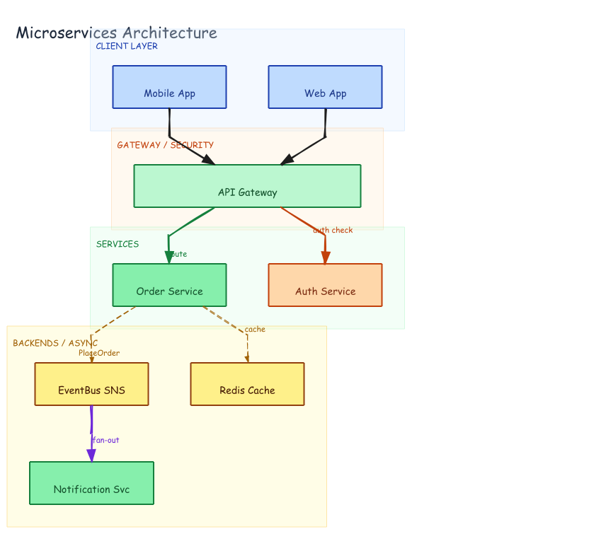

# Microservices Architecture — Four Zones



## Prompt

```
Draw a microservices architecture with four horizontal swim lane zones: CLIENT LAYER
(Web App, Mobile App), GATEWAY / SECURITY (API Gateway wide bar), SERVICES (Auth
Service, Order Service), BACKENDS / ASYNC (Redis Cache, EventBus SNS, Notification
Svc). Connections: clients → Gateway; Gateway → Auth (auth check, red); Gateway →
Order (route, green); Order → Redis (cache, dashed); Order → EventBus (PlaceOrder,
dashed); EventBus → Notification (fan-out, purple). All arrows unidirectional.
```

## Generation

Generated with dagre-layout.js from [`graph.json`](./graph.json). Four-zone TB layout with labeled and styled edges.

```bash
DAGRE=$(python3 -c "import excalidraw_agent_cli,os; print(os.path.join(os.path.dirname(excalidraw_agent_cli.__file__),'..','dagre-layout.js'))")
node "$DAGRE" graph.json --output microservices.excalidraw
excalidraw-agent-cli --project microservices.excalidraw export png --output microservices.png --overwrite
excalidraw-agent-cli --project microservices.excalidraw export svg --output microservices.svg --overwrite
```
