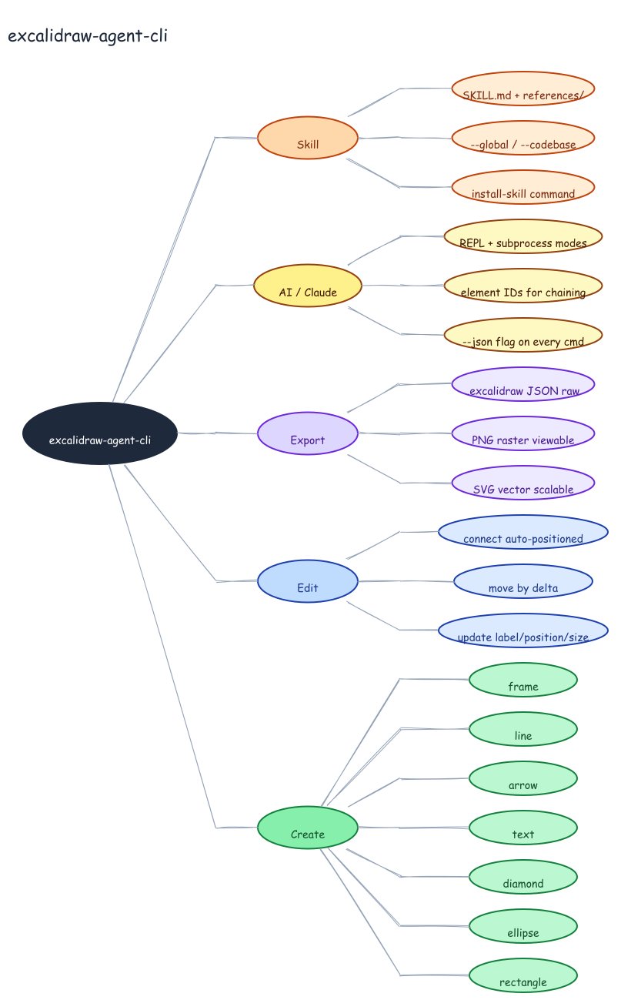

# Mind Map — excalidraw-agent-cli Features



## Prompt

```
Draw a left-to-right mind map for excalidraw-agent-cli. Root node (dark ellipse)
on the left. Five branches fanning right: Create (rectangle / ellipse / diamond /
text / arrow / line / frame), Edit (update label/position/size, move by delta,
connect auto-positioned), Export (SVG vector scalable, PNG raster viewable,
.excalidraw JSON raw), AI / Claude (--json flag on every cmd, element IDs for
chaining, REPL + subprocess modes), Skill (install-skill command, --global /
--codebase, SKILL.md + references/).
```

## Generation

Generated with dagre-layout.js from [`graph.json`](./graph.json). LR mind map layout with `"arrowhead": "none"` — no directed arrowheads on spokes.

```bash
DAGRE=$(python3 -c "import excalidraw_agent_cli,os; print(os.path.join(os.path.dirname(excalidraw_agent_cli.__file__),'..','dagre-layout.js'))")
node "$DAGRE" graph.json --output mindmap.excalidraw
excalidraw-agent-cli --project mindmap.excalidraw export png --output mindmap.png --overwrite
excalidraw-agent-cli --project mindmap.excalidraw export svg --output mindmap.svg --overwrite
```
