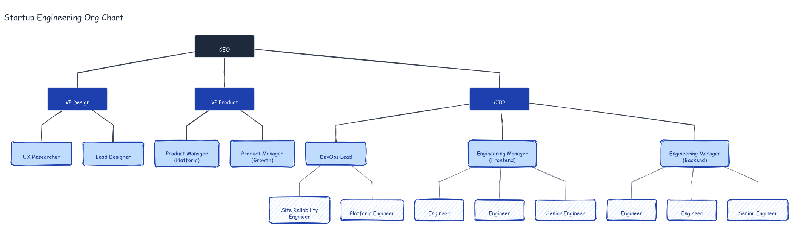

# Startup Engineering Org Chart

An org chart for a startup engineering organization, generated using the dagre TB layout with color-coded levels.

## Prompt

> Generate a startup engineering org chart with CEO at the root, three direct reports (CTO, VP Product, VP Design), managers/leads under each, and individual contributors at the leaf level. Use dagre TB layout, no arrowheads (reporting lines, not flow), and color by level: dark root, dark blue C-suite/VPs, medium blue managers, light blue hachure ICs.

## Structure

- **CEO** — dark root node
- **C-Suite / VPs** — CTO, VP Product, VP Design
- **Managers / Leads** — Engineering Manager (Backend), Engineering Manager (Frontend), DevOps Lead, Product Manager (Growth), Product Manager (Platform), Lead Designer, UX Researcher
- **ICs** — Senior Engineer × 2, Engineer × 4, Platform Engineer, Site Reliability Engineer

## Color Legend

| Level | Fill | Stroke | Style |
|-------|------|--------|-------|
| CEO | `#1e293b` | `#e2e8f0` | solid |
| C-Suite / VPs | `#1e40af` | `#e2e8f0` | solid |
| Managers / Leads | `#bfdbfe` | `#1e40af` | solid |
| ICs / PMs / Designers | `#dbeafe` | `#1e40af` | hachure |

## Generation

```bash
export PATH="/Users/bhushan/Documents/excalidraw/agent-harness/.venv/bin:/Users/bhushan/.nvm/versions/node/v22.9.0/bin:$PATH"
DAGRE=$(python3 -c "import excalidraw_agent_cli,os; print(os.path.join(os.path.dirname(excalidraw_agent_cli.__file__),'..','dagre-layout.js'))")

node "$DAGRE" examples/org-chart/graph.json --output examples/org-chart/org-chart.excalidraw
excalidraw-agent-cli --project examples/org-chart/org-chart.excalidraw export png --output examples/org-chart/org-chart.png --overwrite
excalidraw-agent-cli --project examples/org-chart/org-chart.excalidraw export svg --output examples/org-chart/org-chart.svg --overwrite
```

## Output


