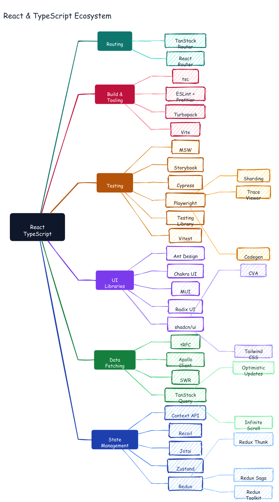

# React & TypeScript Ecosystem — Asymmetric Mind Map

A 4-level mind map where branches have intentionally different depths. The Redux
branch goes root → State Management → Redux → Redux Toolkit/Saga/Thunk (4 levels).
The Routing branch goes root → Routing → React Router/TanStack Router (2 levels).
Dagre handles the asymmetry without any manual coordinate work.



## Prompt

```
Draw an asymmetric mind map of the React + TypeScript ecosystem. Root node at left.
Six branches fanning right — each with a different depth:

State Management (5 children: Redux/Zustand/Jotai/Recoil/Context API;
  Redux has 3 grandchildren: Toolkit/Saga/Thunk)
Data Fetching (4 children: TanStack Query/SWR/Apollo/tRPC;
  TanStack Query has 2 grandchildren: Infinite Scroll/Optimistic Updates)
UI Libraries (5 children: shadcn/Radix/MUI/Chakra/Ant Design;
  shadcn has 2 grandchildren: Tailwind CSS/CVA)
Testing (6 children: Vitest/Testing Library/Playwright/Cypress/Storybook/MSW;
  Playwright has 3 grandchildren: Codegen/Trace Viewer/Sharding)
Build & Tooling (4 children: Vite/Turbopack/ESLint+Prettier/tsc)
Routing (2 children: React Router/TanStack Router)

Color each branch distinctly. No arrowheads on connectors.
```

## Generation time

~5 seconds

## Files generated

| File | Description |
|------|-------------|
| `graph.json` | Declarative graph: nodes, edges, colors — no coordinates |
| `react-ecosystem.excalidraw` | Full Excalidraw JSON with dagre-computed positions |
| `react-ecosystem.svg` | Vector output |
| `react-ecosystem.png` | Raster output |

## Commands

```bash
export PATH="/Users/bhushan/Documents/excalidraw/agent-harness/.venv/bin:/Users/bhushan/.nvm/versions/node/v22.9.0/bin:$PATH"
DAGRE=$(python3 -c "import excalidraw_agent_cli,os; print(os.path.join(os.path.dirname(excalidraw_agent_cli.__file__),'..','dagre-layout.js'))")

node "$DAGRE" examples/react-ecosystem/graph.json \
  --output examples/react-ecosystem/react-ecosystem.excalidraw

excalidraw-agent-cli \
  --project examples/react-ecosystem/react-ecosystem.excalidraw \
  export png --output examples/react-ecosystem/react-ecosystem.png --overwrite

excalidraw-agent-cli \
  --project examples/react-ecosystem/react-ecosystem.excalidraw \
  export svg --output examples/react-ecosystem/react-ecosystem.svg --overwrite
```

## Key design decisions in graph.json

- `"arrowhead": "none"` at the graph level — mind map connectors have no arrowheads
- `"rankSep": 80` — horizontal gap between levels
- `"nodeSep": 12` — tight vertical packing to fit 6 branches
- Root node uses `"fontSize": 16` and larger dimensions to anchor visually
- L1 branch nodes use solid dark fills with white text; L2 lighter; L3 lightest
- Branch colors are consistent across all three levels of each branch
