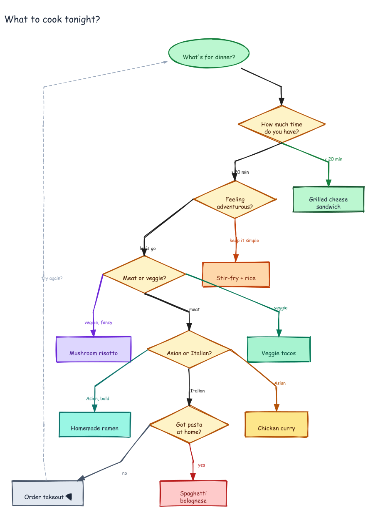

# What to Cook Tonight? — Decision Flowchart

A fun dinner decision tree built with `excalidraw-agent-cli` using the Dagre auto-layout engine.

## Prompt

> Create a "What to cook tonight?" decision flowchart.
>
> - START (ellipse, green): "What's for dinner?"
> - Decision nodes (diamonds, amber): time check, adventurousness, meat/veggie, cuisine, pasta availability
> - Terminal nodes (rectangles, distinct colors): Grilled cheese sandwich, Stir-fry + rice, Spaghetti bolognese, Mushroom risotto, Order takeout, Veggie tacos, Chicken curry, Homemade ramen
> - Back-edge from takeout → start (dashed, gray, label: "try again?")
> - TB direction, rankSep: 90, nodeSep: 40

## Generation

```bash
export PATH="/Users/bhushan/Documents/excalidraw/agent-harness/.venv/bin:/Users/bhushan/.nvm/versions/node/v22.9.0/bin:$PATH"
DAGRE=$(python3 -c "import excalidraw_agent_cli,os; print(os.path.join(os.path.dirname(excalidraw_agent_cli.__file__),'..','dagre-layout.js'))")

node "$DAGRE" examples/recipe-flowchart/graph.json \
  --output examples/recipe-flowchart/recipe-flowchart.excalidraw

excalidraw-agent-cli \
  --project examples/recipe-flowchart/recipe-flowchart.excalidraw \
  export png --output examples/recipe-flowchart/recipe-flowchart.png --overwrite

excalidraw-agent-cli \
  --project examples/recipe-flowchart/recipe-flowchart.excalidraw \
  export svg --output examples/recipe-flowchart/recipe-flowchart.svg --overwrite
```

## Diagram


