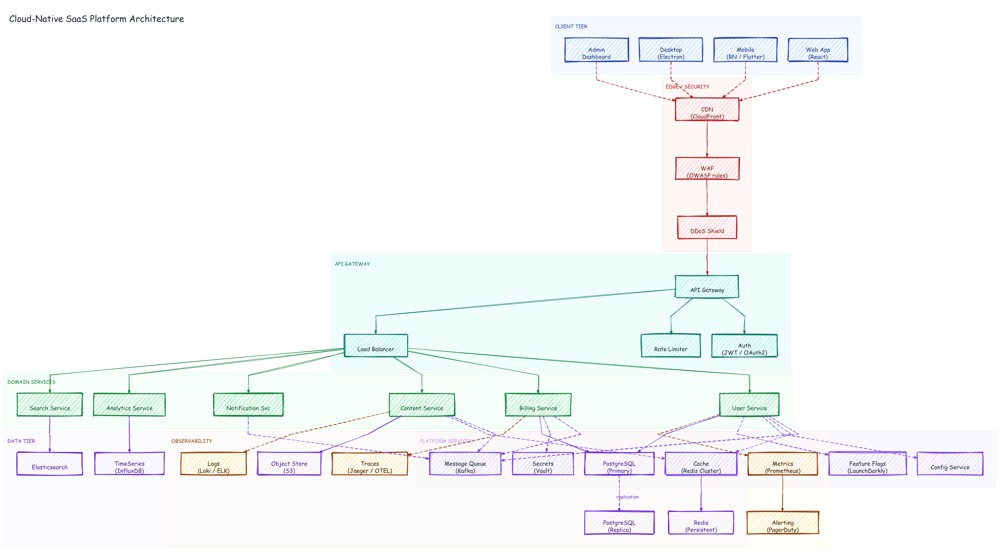

# Cloud-Native SaaS Platform Architecture

A complex architecture diagram with 7 zones and 32 nodes covering the full stack
of a production SaaS application: client tier, edge/CDN/WAF, API gateway layer,
6 domain services, 5 platform services (Kafka, Redis, Vault, LaunchDarkly, Config),
6 data tier nodes, and an observability stack. 44 edges, many dashed to indicate
async/secondary relationships.



## Prompt

```
Draw a top-to-bottom architecture diagram for a cloud-native SaaS platform with
7 zones:

CLIENT TIER: Web App (React), Mobile (RN/Flutter), Desktop (Electron), Admin Dashboard

EDGE / SECURITY: CDN (CloudFront), WAF (OWASP rules), DDoS Shield
  Clients connect to CDN via dashed arrows; CDN → WAF → DDoS → API Gateway

API GATEWAY: API Gateway, Auth (JWT/OAuth2), Rate Limiter, Load Balancer

DOMAIN SERVICES: User Service, Billing Service, Content Service, Notification Svc,
  Analytics Service, Search Service — all from Load Balancer

PLATFORM SERVICES: Message Queue (Kafka), Cache (Redis Cluster), Config Service,
  Secrets (Vault), Feature Flags (LaunchDarkly) — connected from domain services
  via dashed arrows

DATA TIER: PostgreSQL Primary→Replica (replication), Redis Persistent, S3,
  Elasticsearch, TimeSeries (InfluxDB)

OBSERVABILITY: Metrics (Prometheus), Traces (Jaeger/OTEL), Logs (Loki/ELK),
  Alerting (PagerDuty) — Metrics triggers Alerting

Color scheme: blue clients, red edge, teal gateway, green services,
purple platform, violet data, amber observability.
```

## Generation time

~5 seconds (32 nodes, 44 edges, 7 zones)

## Files generated

| File | Description |
|------|-------------|
| `graph.json` | Declarative graph: 32 nodes, 7 zones |
| `saas-platform.excalidraw` | Full Excalidraw JSON with dagre-computed positions |
| `saas-platform.svg` | Vector output |
| `saas-platform.png` | Raster output |

## Commands

```bash
DAGRE=$(python3 -c "import excalidraw_agent_cli,os; print(os.path.join(os.path.dirname(excalidraw_agent_cli.__file__),'..','dagre-layout.js'))")
node "$DAGRE" graph.json --output saas-platform.excalidraw
excalidraw-agent-cli --project saas-platform.excalidraw export png --output saas-platform.png --overwrite
excalidraw-agent-cli --project saas-platform.excalidraw export svg --output saas-platform.svg --overwrite
```

## Why this is hard to build without dagre

32 nodes across 7 zones with 44 edges — placed manually — would require
computing ~64 coordinates, iterating on zone boundaries, and re-adjusting
every time a node label changes width. With `graph.json` + dagre:

1. Declare nodes with labels and colors
2. Declare edges with stroke colors and styles (`solid` vs `dashed`)
3. List which nodes belong to which zone
4. Run dagre — positions computed in milliseconds, zones drawn automatically
