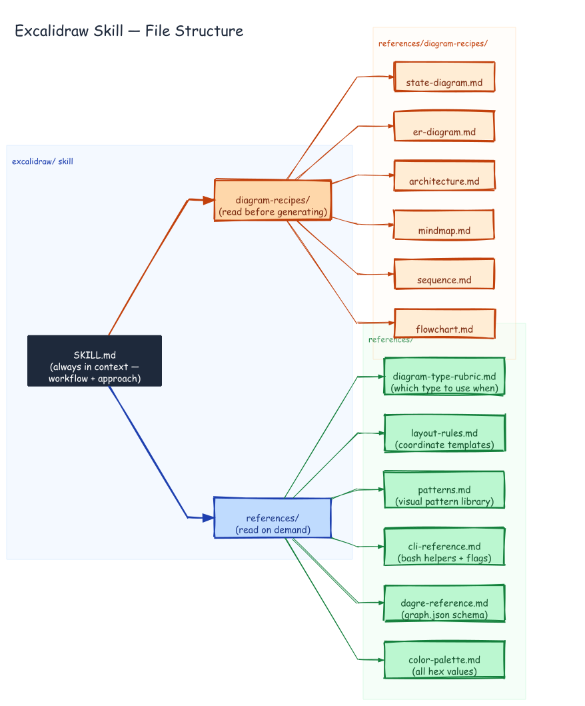

# Excalidraw Skill — File Structure



## Prompt

```
Draw the file structure of the excalidraw skill. Root: SKILL.md (always in context).
Two branches: references/ (color-palette.md, dagre-reference.md, cli-reference.md,
patterns.md, layout-rules.md, diagram-type-rubric.md) and diagram-recipes/
(flowchart.md, sequence.md, mindmap.md, architecture.md, er-diagram.md,
state-diagram.md).
```

## Generation

Generated with dagre-layout.js from [`graph.json`](./graph.json). LR hierarchy showing three levels of the skill's reference file structure.

```bash
DAGRE=$(python3 -c "import excalidraw_agent_cli,os; print(os.path.join(os.path.dirname(excalidraw_agent_cli.__file__),'..','dagre-layout.js'))")
node "$DAGRE" graph.json --output skill-files.excalidraw
excalidraw-agent-cli --project skill-files.excalidraw export png --output skill-files.png --overwrite
excalidraw-agent-cli --project skill-files.excalidraw export svg --output skill-files.svg --overwrite
```
