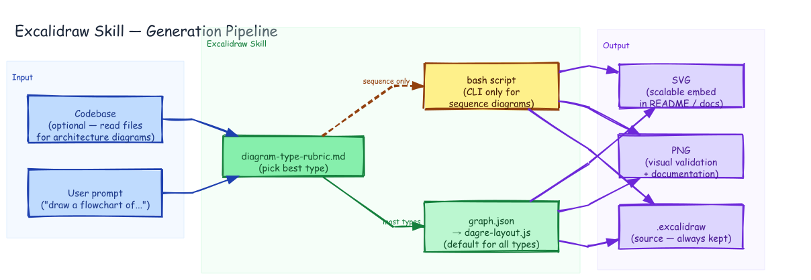

# Excalidraw Skill — Generation Pipeline



## Prompt

```
Draw the excalidraw skill's generation pipeline. Three zones left to right:
INPUT (User prompt, Codebase), EXCALIDRAW SKILL (diagram-type-rubric.md picks
the type, then either graph.json → dagre-layout.js for most types or a bash
script for sequence diagrams only), OUTPUT (.excalidraw source, PNG, SVG).
```

## Generation

Generated with dagre-layout.js from [`graph.json`](./graph.json). Three-zone LR layout showing the decision point between dagre and CLI approaches.

```bash
DAGRE=$(python3 -c "import excalidraw_agent_cli,os; print(os.path.join(os.path.dirname(excalidraw_agent_cli.__file__),'..','dagre-layout.js'))")
node "$DAGRE" graph.json --output skill-pipeline.excalidraw
excalidraw-agent-cli --project skill-pipeline.excalidraw export png --output skill-pipeline.png --overwrite
excalidraw-agent-cli --project skill-pipeline.excalidraw export svg --output skill-pipeline.svg --overwrite
```
